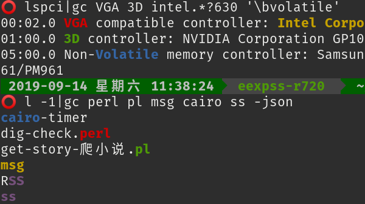
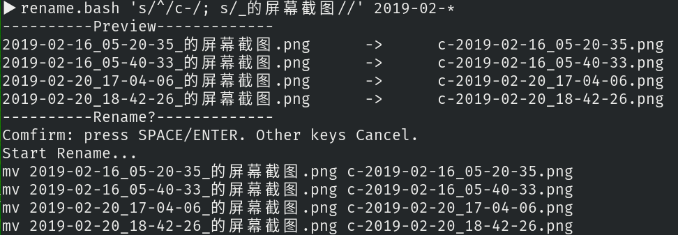
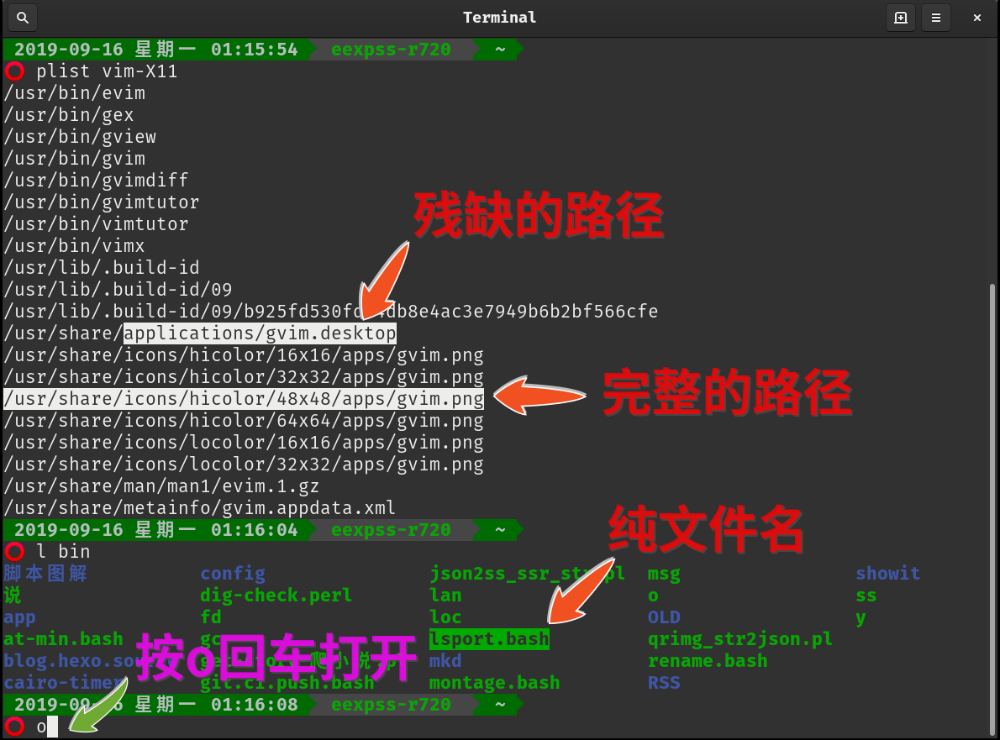
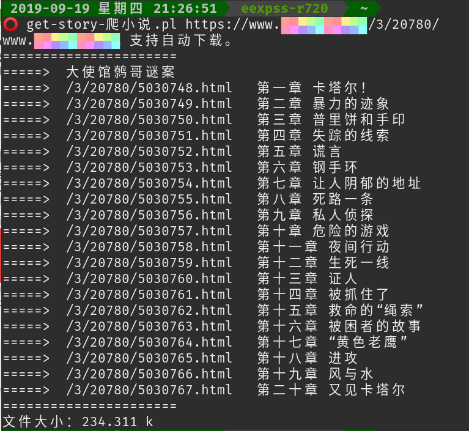
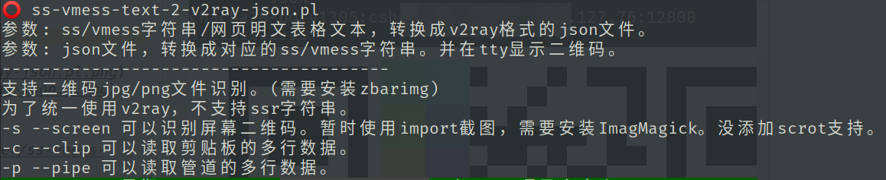
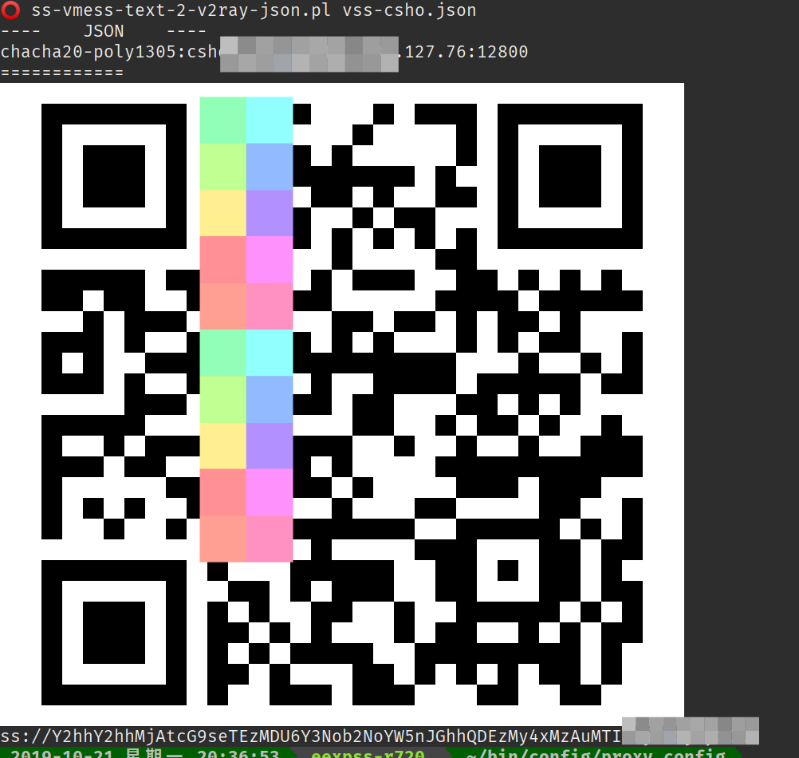
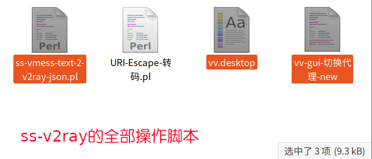
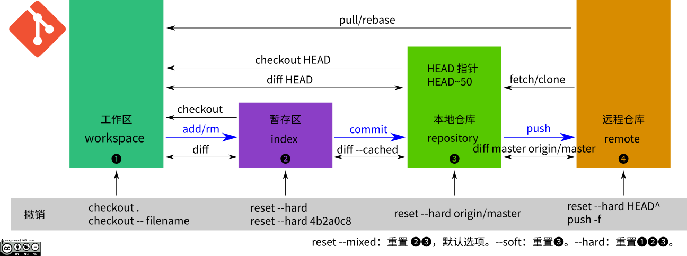

# 好用的脚本图解
---
## fd
> - 搜索当前目录文件，相当于简化美化了的find。参数为"与"关系。
- 多彩色，可排除(减号)，支持正则(和bash冲突的符号需要引号包裹)。


[脚本下载](https://github.com/eexpress/bin/raw/master/fd)

## loc

> - 另外一个类似功能的locate版本。
- 定位当前目录文件。参数为"与"关系。

[脚本下载](https://github.com/eexpress/bin/raw/master/loc)

---
## gc
> - 简化强化了的多个关键词grep，参数为"或"关系。
- 多彩色，可排除，支持正则。
- 只工作在管道环境。
- 如果想要全文输出(不过滤)，只彩色标记，可修改脚本里面的`$o=1;`



[脚本下载](https://github.com/eexpress/bin/raw/master/gc)

---
## rename.bash
> - 批量改名文件。支持连续的perl正则操作。
- 带预览和确认。



[脚本下载](https://github.com/eexpress/bin/raw/master/rename.bash)

---
## o
> - 终端下鼠标选择文件，按o回车，快速打开(xdg-open方式)。
- 参数输入也可以残缺。比如`abc-xyz.json`，可以`o xyz.js`打开。
- 依赖xclip命令。



[脚本下载](https://github.com/eexpress/bin/raw/master/o)

---

---
## catimg


---
## get-story-爬小说
> 爬在线阅读的网站。暂时支持六个网站。



[脚本下载](https://github.com/eexpress/bin/raw/master/get-story-爬小说.pl)

---
## 全能转换格式





[脚本下载](https://github.com/eexpress/bin/raw/master/ss-vmess-QRcode-json.pl)

---
## 点阵显示


---

## git


---

## 简单创立 deb 包的脚本。
> 准备写一个vala带界面的，其实脚本也够了。

> 第一步就是丢文件进去，这是最人性化的。control 和  desktop 可自动生成。
```
⭕ create-deb.pl clip-qrcode-share screenshot0.png  screenshot1.png v0.2
==============================================
==============================================
/tmp/clip-qrcode-share-0.2
├── DEBIAN
│   └── control
└── usr
    ├── bin
    │   └── clip-qrcode-share
    └── share
        ├── applications
        │   └── clip-qrcode-share.desktop
        └── pixmaps
            ├── screenshot0.png
            └── screenshot1.png

6 directories, 5 files
==============================================
Confirm DEBIAN/control and usr/share/applications/clip-qrcode-share.desktop.
Excute `sudo dpkg -b /tmp/clip-qrcode-share-0.2` will create deb file:
==>	/tmp/clip-qrcode-share-0.2.deb
```
